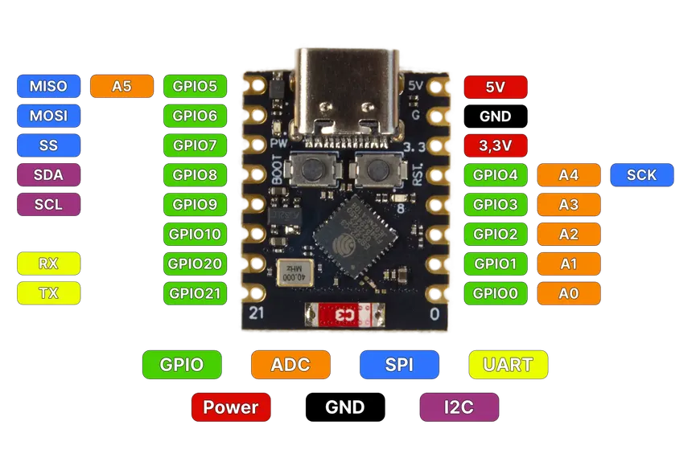
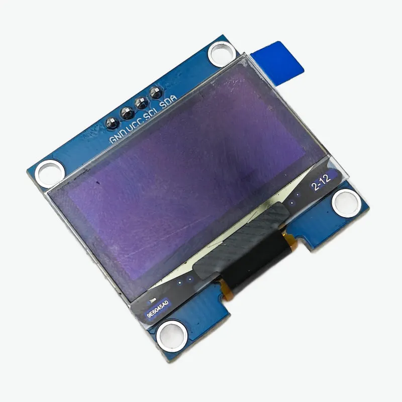
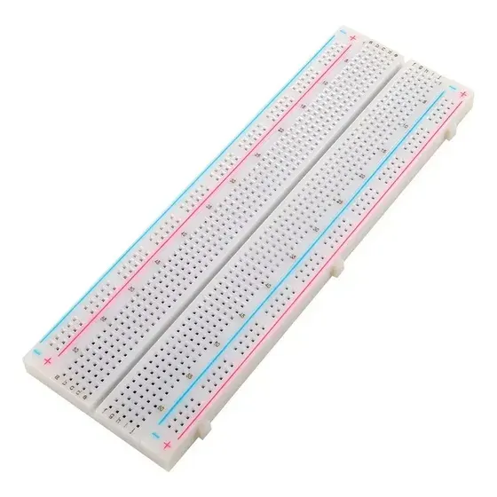
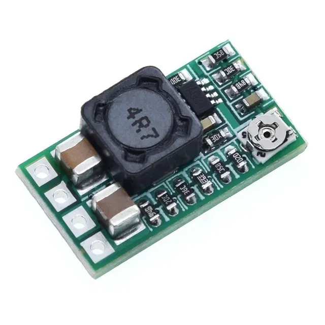

# Animación de Logo en OLED SH1106 con ESP32-C3

Proyecto para mostrar y animar un logo personalizado en una pantalla OLED
128x64 basada en el controlador **SH1106**, utilizando un **ESP32-C3 Super Mini**
y la librería **U8g2**.

El proyecto demuestra el uso de bitmaps en memoria Flash, animaciones simples
y comunicación I2C por software.

🎥 **Tutorial completo en YouTube:**  
👉 https://www.youtube.com/TU_ENLACE_AQUI

---

## 🧾 Lista de Materiales (BOM)

### 🔹 ESP32-C3 Super Mini

Microcontrolador principal del proyecto. Se encarga del control de la pantalla
OLED, la animación del logo y la gestión del tiempo sin usar `delay()`.

---

### 🔹 Pantalla OLED 128x64 SH1106

Pantalla monocromática con interfaz I2C utilizada para mostrar el logo animado.

---

### 🔹 Protoboard

Utilizada para el armado del circuito sin necesidad de soldadura.

---

### 🔹 Regulador de voltaje 3.3V

Regulador balanceado para alimentar correctamente el ESP32-C3 y la pantalla OLED.

---

### 🔹 Cables Dupont (Jumpers)

Cables para realizar las conexiones entre los componentes.

---

## 🔌 Conexiones

| OLED SH1106 | ESP32-C3 |
|------------|----------|
| VCC        | 3.3V     |
| GND        | GND      |
| SDA        | GPIO 8   |
| SCL        | GPIO 9   |

> La comunicación I2C se realiza por **software** usando la librería U8g2.

*(Ver diagrama de conexiones en la carpeta `/diagrams`)*

---

## 🖼️ Preparación del Logo

1. Diseñar el logo en formato **PNG**
2. Convertirlo a **BMP monocromático**
3. Usar la herramienta **image2cpp**
   - Resolución: **64x64** o **128x64**
   - Formato: **U8g2**
4. Copiar el array generado dentro del archivo `.ino`
5. Guardar el bitmap en **PROGMEM** para optimizar memoria

---

## 📚 Librerías necesarias

- **U8g2** – https://github.com/olikraus/u8g2

Instalar desde el **Administrador de Librerías** del IDE de Arduino.

---

## 🚀 Funcionamiento

El programa:

- Inicializa la pantalla OLED
- Carga el logo desde memoria Flash
- Dibuja el bitmap usando `drawXBM()`
- Aplica animaciones simples:
  - Desplazamiento sutil
  - Efecto sombra
  - Animación por frames
- Usa control de tiempo con `millis()` (no bloqueante)

---

## 📸 Resultado

🎬 **Logo animado en OLED SH1106 (YouTube Short)**  
👉 https://www.youtube.com/@RM_COL

---

## 📂 Estructura del Proyecto

├── oled_logo_animation.ino
├── assets/
│ ├── ESP32C3SuperMini.webp
│ ├── oledsh1106.webp
│ ├── protoboard.webp
│ ├── regulador.webp
│ └── jumpers.webp
├── diagrams/
│ └── conexion_oled_esp32c3.png
├── README.md
└── LICENSE

---

## 📄 Licencia

Este proyecto se distribuye bajo la licencia **MIT**  
Uso libre para fines educativos y personales.
